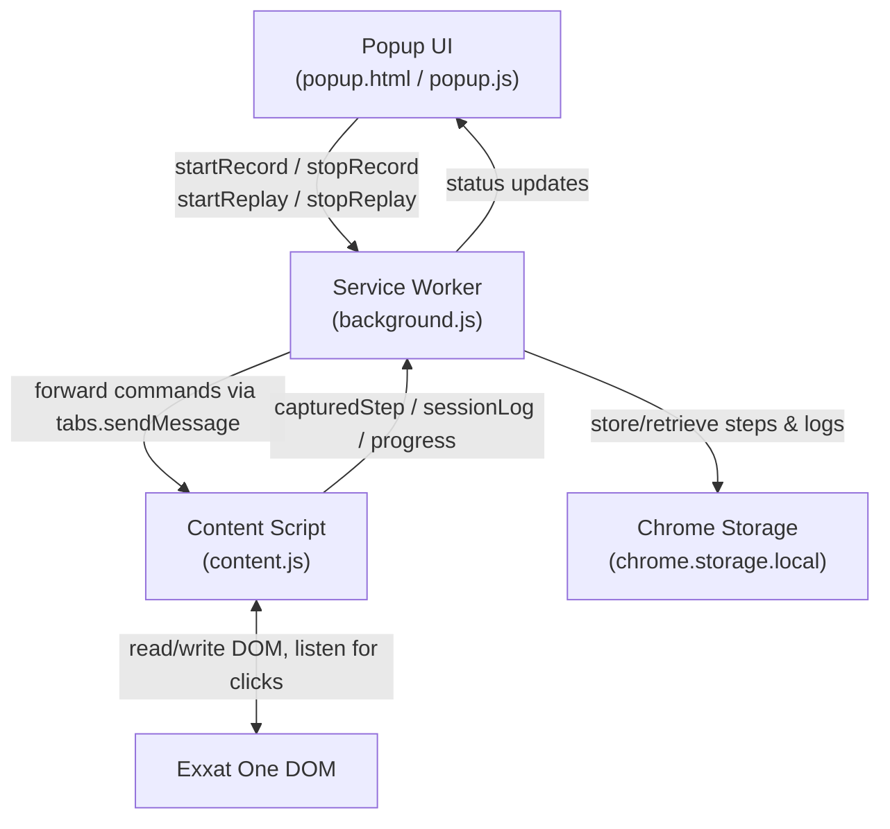

# Design Document: Exxat One Downloader Extension

## Overview

A Chrome Manifest V3 browser extension that automates document downloads on the Exxat One platform. The extension operates in two modes: **Record** (captures user click/scroll interactions as a replayable step sequence) and **Replay** (executes the recorded steps across all eligible student table rows, handling pagination and variable document counts automatically).

The extension injects a content script into Exxat One pages to intercept DOM events and drive automation. A popup UI provides controls for recording, replaying, and reviewing session logs.

---

## Architecture



- The **Popup** is the user-facing control panel.
- The **Service Worker (background.js)** coordinates state, routes messages, and manages storage.
- The **Content Script (content.js)** is injected into the active Exxat One tab. It handles all DOM interaction: recording clicks, building selectors, and driving replay.
- **Chrome Storage** persists the recorded step sequence and session logs across popup open/close cycles.

---

## Components and Interfaces

### 1. Popup UI (`popup.html` / `popup.js`)

Responsibilities:
- Display current mode (idle / recording / replaying)
- Buttons: Start Recording, Stop Recording, Start Replay, Stop Replay, Clear Steps, Export Log
- Show recorded step count
- Show live replay progress (processed / skipped / failed / total)
- Show session summary on completion

Messages sent to background:
```
{ action: "START_RECORD" }
{ action: "STOP_RECORD" }
{ action: "START_REPLAY" }
{ action: "STOP_REPLAY" }
{ action: "CLEAR_STEPS" }
{ action: "EXPORT_LOG" }
```

Messages received from background:
```
{ type: "STATUS_UPDATE", payload: { mode, stepCount, progress, log } }
```

---

### 2. Service Worker (`background.js`)

Responsibilities:
- Maintain extension state machine: IDLE → RECORDING → IDLE → REPLAYING → IDLE
- Forward commands from popup to the active content script tab
- Receive step captures and progress updates from content script
- Read/write recorded steps and session log to `chrome.storage.local`
- Broadcast status updates back to popup

State shape:
```js
{
  mode: "IDLE" | "RECORDING" | "REPLAYING",
  steps: Step[],
  sessionLog: LogEntry[],
  progress: { processed: number, skipped: number, failed: number, total: number }
}
```

---

### 3. Content Script (`content.js`)

Responsibilities:
- **Record mode**: Attach a capturing click listener to `document`. On each click, compute a stable DOM selector for the target element and post a `STEP_CAPTURED` message to the background.
- **Record mode**: Attach a scroll listener to detect scroll actions and record them as steps.
- **Replay mode**: Receive the step array from background. Iterate table rows, check Onboarding Status, skip "Not Started" rows, execute steps for eligible rows, handle back-navigation, handle pagination.

Key internal functions:
```
buildSelector(element) → string         // produces stable CSS selector
waitForElement(selector, timeout) → Element  // polls DOM until element appears
getOnboardingStatus(row) → string       // reads status cell from a row
getTableRows() → Element[]              // returns current page's table rows
clickNextPage() → boolean               // clicks Next pagination button, returns false if none
executeStep(step) → Promise<void>       // executes a single recorded step
replayForRow(row, steps) → Promise<"success"|"skip"|"fail">
runReplaySession(steps) → Promise<void> // outer loop: pages → rows → steps
```

---

### 4. Selector Builder

The selector builder produces the most stable selector possible for a clicked element, evaluated in priority order:

1. `[data-testid="..."]`
2. `[data-id="..."]` or other `data-*` attributes
3. `#id` (if the ID does not look auto-generated, e.g., no numeric suffix)
4. A short class-based CSS path (up to 3 ancestors)
5. XPath as a last resort

This is critical for React apps where class names and IDs can be dynamic.

---

## Data Models

### Step
```ts
interface Step {
  type: "click" | "scroll";
  selector: string;          // stable DOM selector
  tag: string;               // e.g. "button", "a"
  textContent: string;       // trimmed inner text for human readability
  scrollDirection?: "up" | "down";
  scrollContainer?: string;  // selector of scroll container
  isRepeating?: boolean;     // true if this step is part of the per-document loop
}
```

### LogEntry
```ts
interface LogEntry {
  rowIndex: number;
  studentId: string;         // email or name extracted from the row
  status: "processed" | "skipped" | "failed" | "warned";
  reason?: string;           // failure or skip reason
  timestamp: string;         // ISO 8601
}
```

### ExtensionState
```ts
interface ExtensionState {
  mode: "IDLE" | "RECORDING" | "REPLAYING";
  steps: Step[];
  sessionLog: LogEntry[];
  progress: {
    processed: number;
    skipped: number;
    failed: number;
    total: number;
  };
}
```

---

## Correctness Properties

*A property is a characteristic or behavior that should hold true across all valid executions of a system — essentially, a formal statement about what the system should do. Properties serve as the bridge between human-readable specifications and machine-verifiable correctness guarantees.*

### Property 1: Selector round-trip stability
*For any* DOM element passed to `buildSelector`, parsing the resulting selector string back against the same DOM should return the same element (i.e., `document.querySelector(buildSelector(el)) === el`).
**Validates: Requirements 1.2**

### Property 2: Skip invariant
*For any* table row whose Onboarding Status cell value is "Not Started", the replay engine should never execute any recorded step against that row — the row's processed count must remain zero and a skip entry must appear in the log.
**Validates: Requirements 3.1, 3.2, 3.4**

### Property 3: Eligible row inclusion
*For any* table row whose Onboarding Status is "Action Needed" or "Compliant Confirmed", the replay engine must include that row in the processing queue and attempt step execution.
**Validates: Requirements 3.3**

### Property 4: Step sequence completeness
*For any* recorded step sequence of length N and any eligible row, the replay engine must attempt all N steps in order before marking the row as processed or failed — no steps may be silently dropped.
**Validates: Requirements 2.1, 2.2**

### Property 5: Pagination exhaustion
*For any* multi-page table, after a full replay session the union of all processed + skipped + failed rows must equal the total row count across all pages (no rows are silently omitted).
**Validates: Requirements 4.1, 4.2, 4.3**

### Property 6: Log entry per row
*For any* row encountered during a session, exactly one log entry (processed / skipped / failed / warned) must exist in the session log for that row — no row produces zero or more than one log entry.
**Validates: Requirements 2.5, 3.4, 5.3, 6.1**

### Property 7: Step persistence round-trip
*For any* recorded step array, serializing it to `chrome.storage.local` and then deserializing it must produce a step array that is deeply equal to the original.
**Validates: Requirements 1.3**

---

## Error Handling

| Scenario | Behavior |
|---|---|
| Target element not found within timeout | Log failure for row, skip to next row |
| Tab closed / navigated away during replay | Pause session, show interruption warning in popup |
| Student has eligible status but zero documents | Log warning entry, continue to next row |
| Pagination "Next" button absent or disabled | Treat as last page, end session |
| Storage read/write failure | Show error in popup, do not start session |
| React re-render invalidates selector mid-replay | Retry selector resolution up to 3 times with 500ms delay |

---

## Testing Strategy

### Property-Based Testing

Library: **fast-check** (JavaScript/TypeScript)

Each property-based test runs a minimum of 100 iterations with randomly generated inputs.

Every property-based test is tagged with:
`// Feature: exactone-downloader-extension, Property {N}: {property_text}`

Properties to implement as PBTs:

| Property | Test description |
|---|---|
| P1: Selector round-trip | Generate random DOM trees, call `buildSelector`, verify `querySelector` returns same element |
| P2: Skip invariant | Generate random row arrays with mixed statuses, run filter logic, verify "Not Started" rows never appear in the execution queue |
| P3: Eligible row inclusion | Same setup as P2 — verify "Action Needed" / "Compliant Confirmed" rows always appear in queue |
| P4: Step sequence completeness | Generate random step arrays and mock rows, verify replay attempts all N steps in order |
| P5: Pagination exhaustion | Generate multi-page mock tables, run session, verify processed+skipped+failed = total rows |
| P6: Log entry per row | Generate sessions with random row counts and statuses, verify log has exactly one entry per row |
| P7: Step persistence round-trip | Generate random Step arrays, serialize/deserialize, verify deep equality |

### Unit Tests

- `buildSelector`: specific known DOM structures → expected selector strings
- `getOnboardingStatus`: mock row elements with each of the three status values
- `waitForElement`: element present immediately, element appears after delay, timeout exceeded
- Popup state rendering: each mode (IDLE / RECORDING / REPLAYING) renders correct controls
- Log export: given a known log array, verify CSV output format
